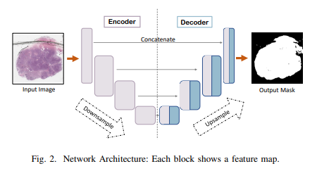
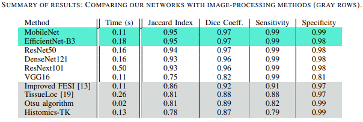

# A Comparative Study of U-Net Topologies for Background Removal in Histopathology Images
### Paper Abstract
During the last decade, the digitization of pathology has gained considerable momentum. Digital pathology offers many advantages including more efficient workflows, easier collaboration as well as a powerful venue for telepathology. At the same time, applying Computer-Aided Diagnosis (CAD) on Whole Slide Images (WSIs) has received substantial attention as a direct result of the digitization. The first step in any image analysis is to extract the tissue. Hence, background removal is an essential prerequisite for efficient and accurate results for many algorithms. In spite of the obvious discrimination for human operators, the identification of tissue regions in WSIs could be challenging for computers, mainly due to the existence of color variations and artifacts. Moreover, some cases such as alveolar tissue types, fatty tissues, and tissues with poor staining are difficult to detect. In this paper, we perform experiments on U-Net architecture with different network backbones (different topologies) to remove the background as well as artifacts from WSIs in order to extract the tissue regions. We compare a wide range of backbone networks including MobileNet, VGG16, EfficientNet-B3, ResNet50, ResNext101 and DenseNet121. We trained and evaluated the network on a manually labeled subset of The Cancer Genome Atlas (TCGA) Dataset. EfficientNet-B3 and MobileNet by almost 99% sensitivity and specificity reached the best results.

See images source at [Kimia Lab](https://kimialab.uwaterloo.ca/kimia/index.php/ijcnn-2020-u-net-based-background-removal-in-histopathology/) and in the paper: [A Comparative Study of U-Net Topologies for
Background Removal in Histopathology Images](https://arxiv.org/abs/2006.06531) figure 2 and table I.

### Useful Links
- [Read the paper](https://arxiv.org/abs/2006.06531)
- [Learn more on Kimia Lab](https://kimialab.uwaterloo.ca/kimia/index.php/ijcnn-2020-u-net-based-background-removal-in-histopathology/)
### Disclaimer
Kimia Lab at Mayo Clinic does not own the code in this repository. The code and data were produced in Kimia Lab at the University of Waterloo. The code is provided as-is without any guarantees, and is stored here as part of Kimia Lab's history. We welcome questions and comments.

This code is intended for research purposes only. Before using or cloning this repository, please read the [End User Agreement](agreement.pdf).
